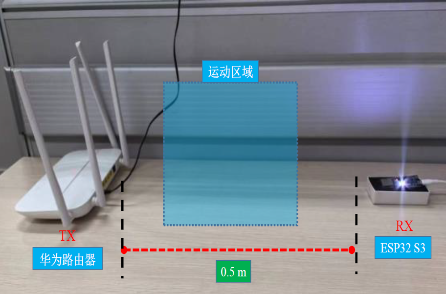
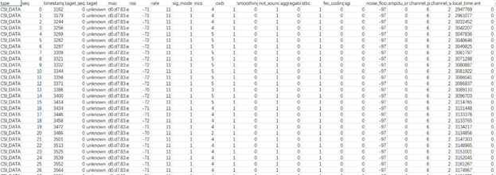
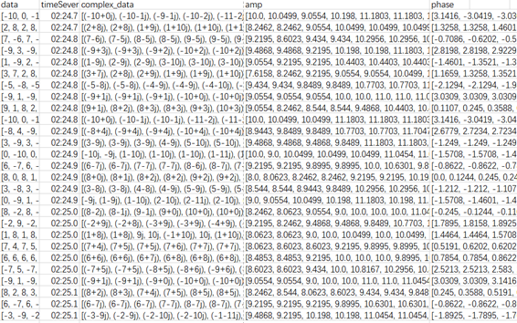

# 基于WI-FI信号的人体感知

以下基于本人所做工作时使用的方法，其中的参数和使用的方法后续仍需修改、优化。

本系统分为数据采集、数据预处理、特征提取和学习识别四个部分。

## 数据采集

其中路由器为WI-FI信号发射端，ESP-S3为接收端。

发射端路由器只要处于正常开启状态即可。

接收端ESP32-S3需要经过烧录连接电脑才能接受WI-FI信号。烧录教程请参考https://github.com/espressif/esp-csi 电脑需要安装esp-csi-master命令行，文件及说明在esp-csi-master中。

采集的代码为mulitiSerials.py和sametimeProcess.py，直接运行即可采集数据。数据为15秒一组。**在采集数据时需要创建名称为动作标签的文件夹，同时在更改采集代码中的CSV储存地址。**

采集到的数据格式如下所示：

为尽量减轻环境因素变化带来的影响，我们在桌面采集动作时的环境设计为

为保证效果尽量在连线处做动作。我们初步设计的动作为：人不在电脑前、人在电脑前注视屏幕但无动作、人在电脑前敲击键盘、人在电脑前移动鼠标。动作幅度尽量大，初期每种数据采集150组。根据实验效果来确定后续的动作设计。

## 数据预处理

采集到的数据当中data列为子载波的信息，我们需要使用process_raw_data.py将数据转换为复数形式并且提取数据中的振幅与相位信息。

处理得到的数据如下所示：

理论来讲我们提取到的data中有104个数据，组成52个子载波的信息，但一部分实际测量到的数据多于104，我们在此只是简单的提取前104个。

其中complex_data列是处理后的复数形式，amp列是计算得到的幅度信息，phase是计算得到的相位信息。

处理后我们使用Hampel滤波去除离群点。

由于人体动作频率较低，再去除噪声时我们要去除环境中的高频噪声。因此我们使用低通滤波器，截止频率设置为5Hz。

离群点去除和低通滤波的具体代码为process_data.py。

## 特征提取

计划书中特征提取使用的PCA方法，我们使用PCA.py对于个别具体的数据进行处理可以得到前3主特征就能包含几乎所有的信息。因此我们只保留前3个特征的信息。

本实验中csv文件的读取需要大量的时间，因此我们为了后续特征学习的高效性，我们将文件中的数据输出到nparray文件中。export_array.py包括了数据的预处理和数组输出。

Concatenate_nparray可以将同一名称的amp数组和phase数据结合起来。

## 学习识别

在后续的识别过程中我们选择机器学习和LSTM、GRU。SVM_model.py中使用了SVM来学习。LSTM中使用LSTM来学习，每个样本的数据规模为1500*3，样本标签为文件夹名称。
